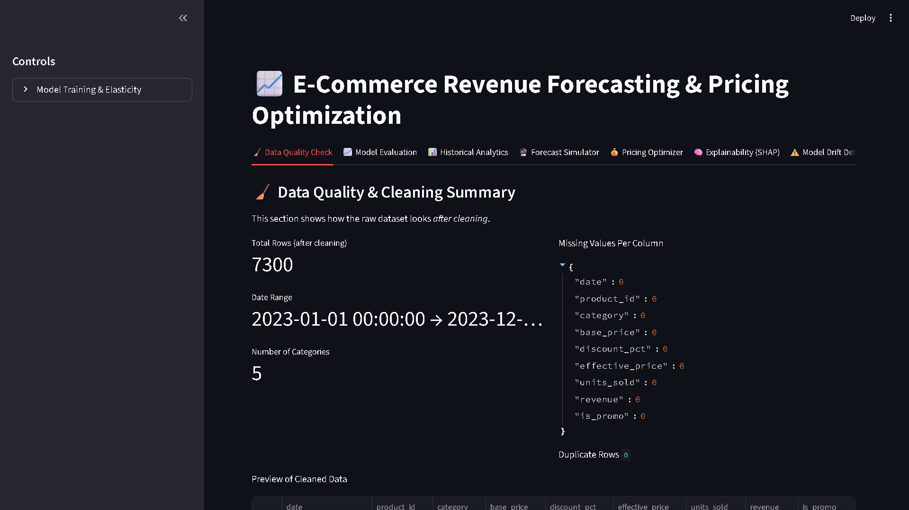
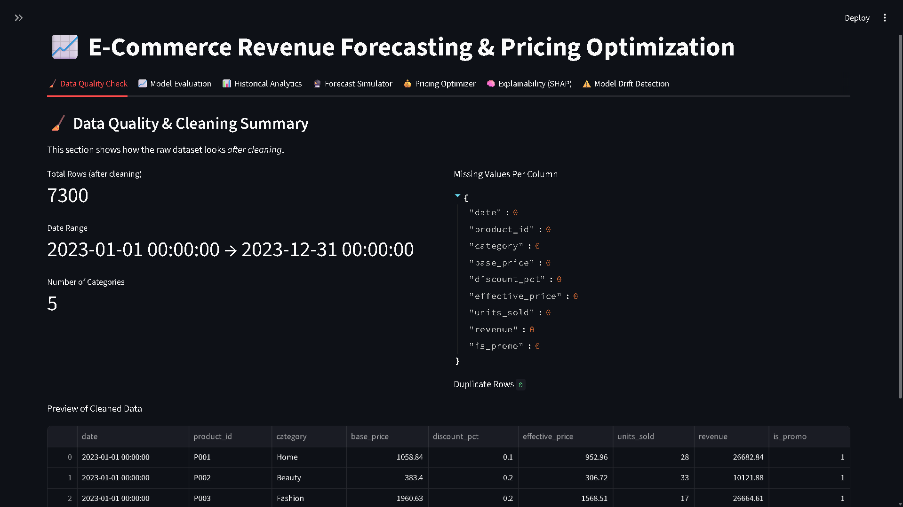
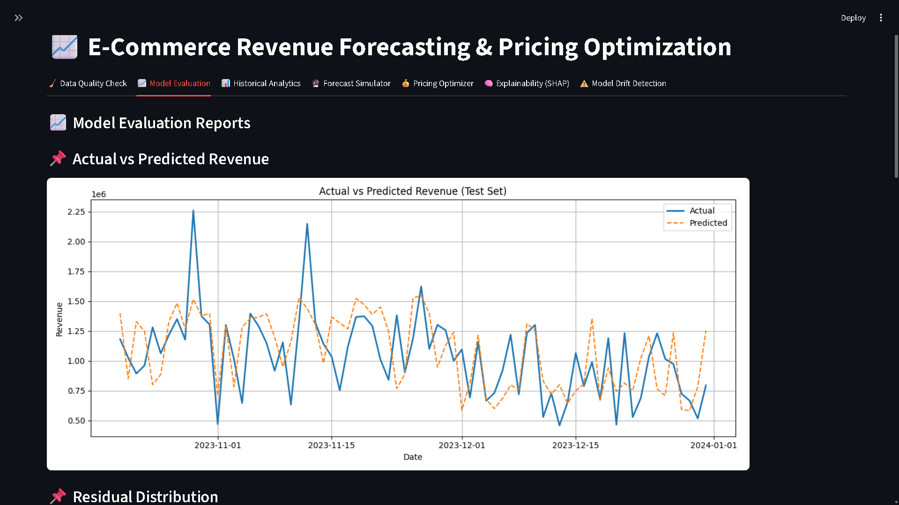
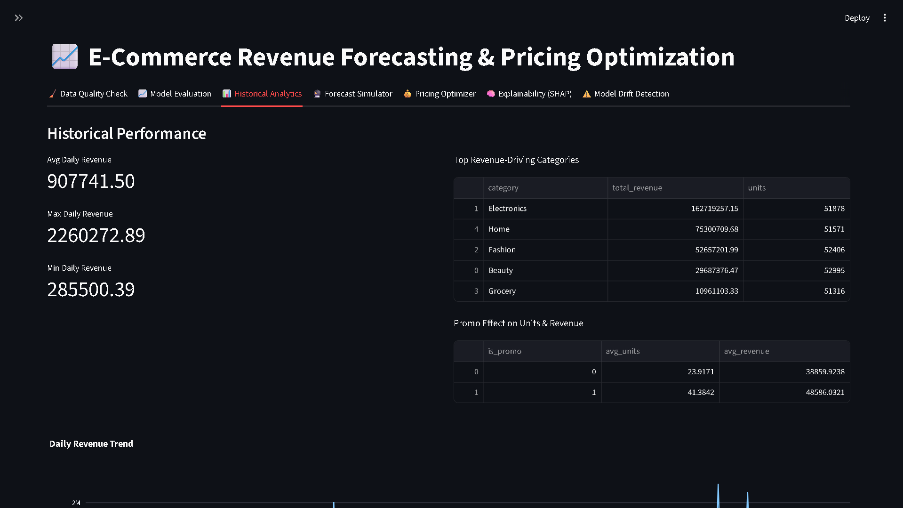
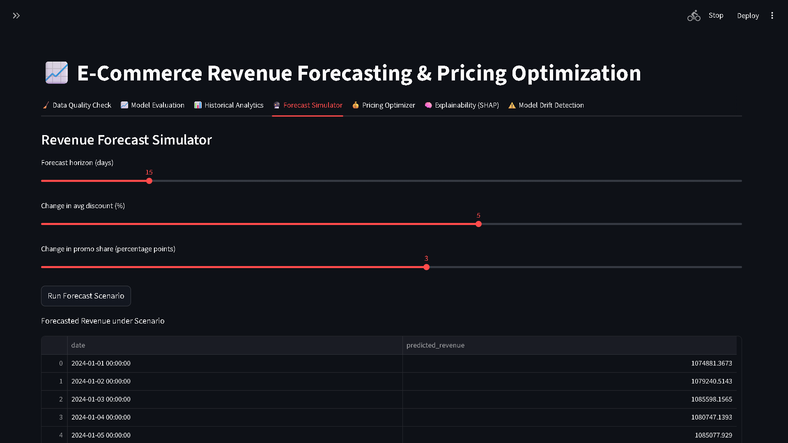
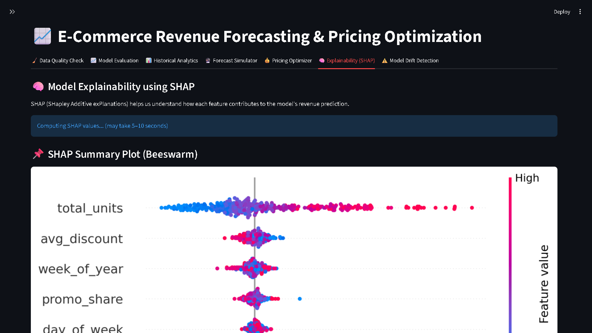
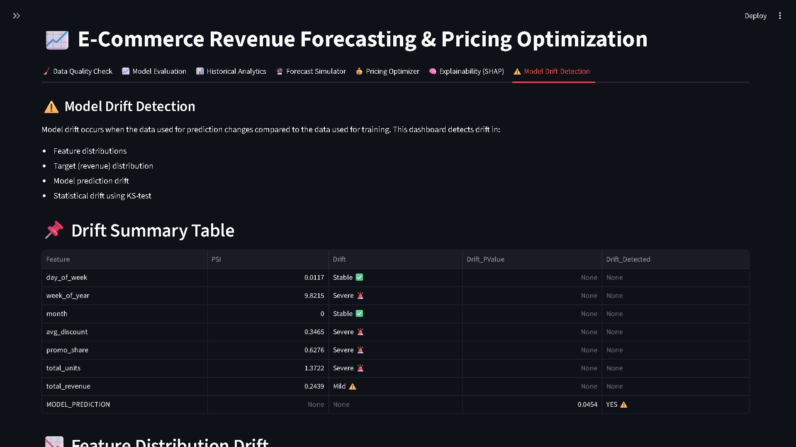
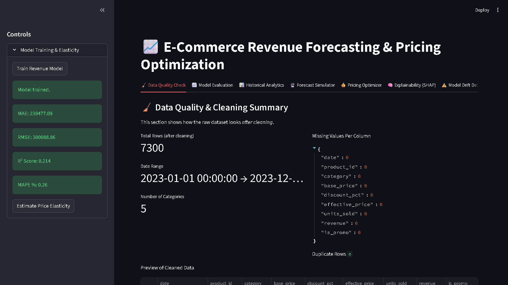
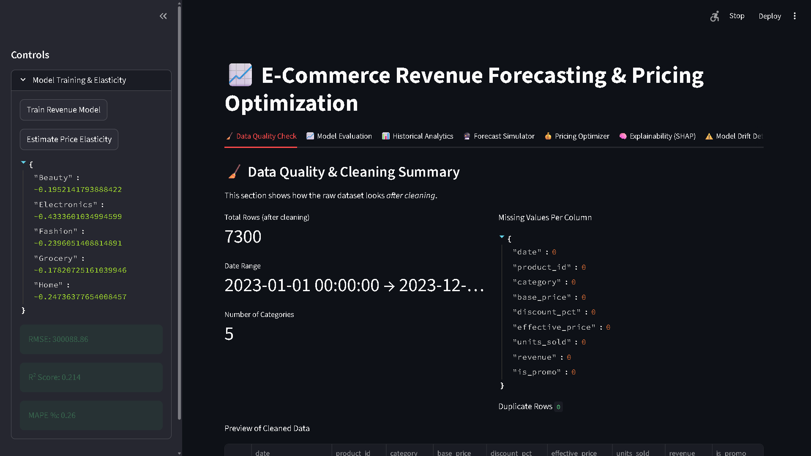

# 📘 **E-Commerce Revenue Forecasting & Dynamic Pricing Optimization System**

### **A complete ML-powered decision intelligence platform for e-commerce: revenue forecasting, elasticity-based price optimization, SHAP explainability, model drift detection, automated data cleaning, and Streamlit dashboard.**

---

# 🧩 **1. Project Overview**

This project is an **end-to-end decision intelligence platform** for e-commerce businesses.
It helps answer key business questions:

* How much revenue will we generate next week?
* Which categories are price-sensitive?
* How do discount strategies change revenue?
* How stable is our model—has drift occurred?
* Why is the model predicting what it predicts? (SHAP Explainability)

The system includes:

✔ Synthetic data generation
✔ Professional automated cleaning
✔ ML revenue forecasting
✔ Dynamic pricing engine
✔ Price elasticity estimation
✔ SHAP Explainability (beeswarm, force, bar, waterfall, comparison)
✔ Model drift detection
✔ Streamlit interactive dashboard
✔ Automated evaluation visualizations
✔ Full unit testing + Advanced test suite + CI/CD

---

# 🏢 **2. Business Problem & Motivation**

E-commerce companies need to make **data-driven decisions** on pricing, promotions, forecasting, and product-level strategy.
This project simulates a real-company analytics workflow using machine learning + explainability.

---

# 🧬 **3. Tech Stack**

### **Languages & Core**


### **Data & ML**


### **Visualization**


### **Models**


### **App / Dashboard**


### **Testing**


### **Utilities**


---

# 🧼 **4. Data Cleaning Pipeline**

Raw transactional data is cleaned automatically through `app/cleaning.py`, which handles:

* Missing values
* Outliers
* Wrong discounts
* Incorrect revenue
* Negative units
* Invalid promo flags
* Duplicate rows
* Date validation

✔ Ensures **high-quality modeling data**.

---

# 🖼️ **5. Screenshots**

A visual walkthrough of the complete Streamlit dashboard.

### **1️⃣ Dashboard Overview**



### **2️⃣ Data Quality Check**



### **3️⃣ Model Evaluation**



### **4️⃣ Historical Analytics**



### **5️⃣ Forecast Simulator**



### **6️⃣ Pricing Optimizer**


### **7️⃣ SHAP Explainability**



### **8️⃣ Model Drift Detection**



---


# 📁 **6. Project Folder Structure**

```
Ecommerce-Revenue-Pricing-Optimizer/
│
├── app/
│   ├── cleaning.py               # Data cleaning pipeline
│   ├── data_loader.py            # Loads raw + processed data
│   ├── forecasting.py            # Model training, evaluation, plots
│   ├── pricing.py                # Elasticity + dynamic pricing
│   ├── insights.py               # Business insights & data quality
│   ├── drift_utils.py            # PSI-based drift detection
│   └── streamlit_app.py          # Full Streamlit dashboard
│
├── data/
│   ├── synthetic_generator.py
│   ├── raw
│   │   └── transactions.csv
│   └── processed
│       └── modeling_data.csv
│
├── models/
│   ├── revenue_model.pkl
│   └── elasticity.json
│
├── reports/
│   ├── csv
│   │   └── evaluation_report.txt
│   └── visuals
│       ├── actual_vs_predicted.png
│       ├── residual_distribution.png
│       ├── feature_importance.png
│       └── error_over_time.png
│
│
├── screenshots/
│   ├── dashboard_overview.png
│   ├── data_quality.png
│   ├── estimate_price_elasticity.png
│   ├── forecast_simulator.png
│   ├── historical_analytics.png
│   ├── model_drift.png
│   ├── model_evaluation.png
│   ├── pricing_optimizer.png
│   ├── shap_explainability.png
│   └──  train_model.png
│
├── tests/
│   ├── test_data_loader.py
│   ├── test_forecasting.py
│   ├── test_pricing.py
│   ├── test_app_model_file.py
│   ├── test_shap_explainability.py
│   ├── test_drift_detection.py
│   ├── test_visualizations.py
│   ├── test_forecast_stress.py
│   ├── test_pricing_stress.py
│   └── test_data_integrity.py
│
├── README.md
└── requirements.txt
```

---

# 📊 **7. Streamlit Dashboard Overview**

Your dashboard contains the following **tabs**:

1. 🧹 **Data Quality Validation**
2. 📈 **Model Evaluation (Visuals)**
3. 📊 **Historical Analytics**
4. 🔮 **Forecast Simulator**
5. 💰 **Pricing Optimizer**
6. 🧠 **SHAP Explainability**
7. ⚠️ **Model Drift Detection**

---

# 🚀 **8. How to Run the Project**

### ✅ **STEP 1 — Clone the Repository**

```bash
git clone https://github.com/girishshenoy16/Ecommerce-Revenue-Pricing-Optimizer.git
cd Ecommerce-Revenue-Pricing-Optimizer
```

### ✅ **STEP 2 — Create Virtual Environment

```bash
python -m venv venv
venv\Scripts\activate  # Windows
```


### ✅ **STEP 3 — Install Dependencies

```bash
python.exe -m pip install --upgrade pip
pip install -r requirements.txt
```

### ✅ **STEP 4 — Generate Synthetic Data (once only)**

```
python data/synthetic_generator.py
```

### ✅ **STEP 5 — Clean the Data**

```
python app/data_preprocessing.py
```

---

### ✅ **STEP 6 — Launch the Streamlit App**

```
streamlit run app/streamlit_app.py
```

---

### ⭐ **STEP 7 — IMPORTANT FIRST RUN ACTIONS (DONE INSIDE STREAMLIT)**

On first launch:

### **Open the Sidebar and click:**

1. **Train Revenue Model**

> **Refer image below**




2. **Estimate Price Elasticity**

> **Refer image below**




This generates:

* `revenue_model.pkl`
* `elasticity.json`
* Evaluation plots (saved to `/reports/`)

After this, all tabs will work.

---

# 🧪 **9. Testing the Project**

Run all tests:

```
pytest -q
```

Run with verbose output:

```
pytest -v
```

Your test suite includes:

* Data loader tests
* Model training tests
* Pricing logic tests
* SHAP explainability tests
* Visualization tests
* Stress tests
* Drift detection tests

---


# 💡 **10. Key Business Insights**

* Electronics category has high price sensitivity
* Higher discounts → higher unit sales but lower margin
* Weekend & festive months (Oct–Nov) show spikes
* Promo share strongly influences daily revenue
* Model drift occurs during seasonal shifts (expected)

---

# 🚀 **11. Future Enhancements**

* SARIMA / Prophet forecasting
* Multi-product elasticity
* Automated retraining pipeline
* Inventory-aware price optimization
* Deployment on Streamlit Cloud
