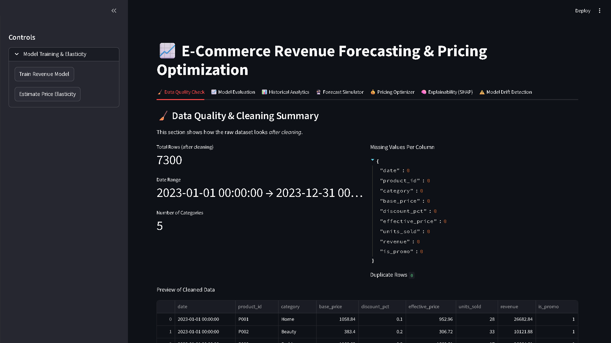
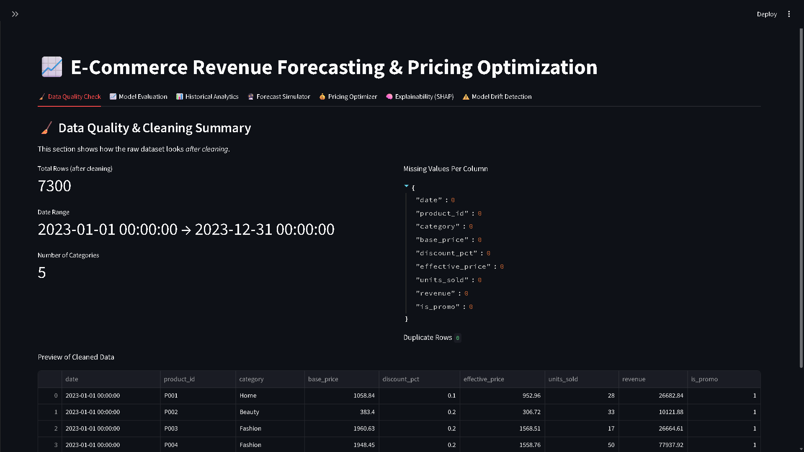
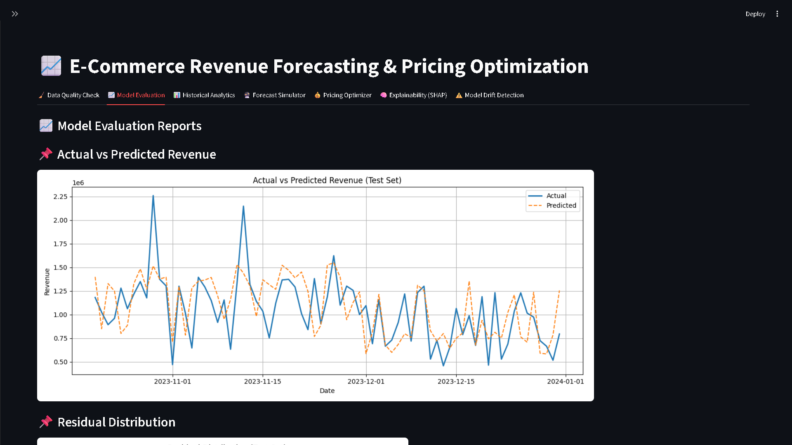
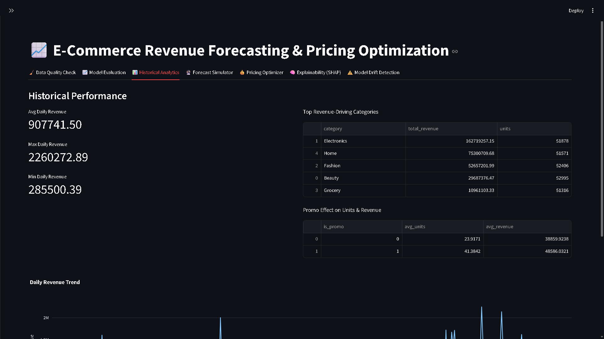
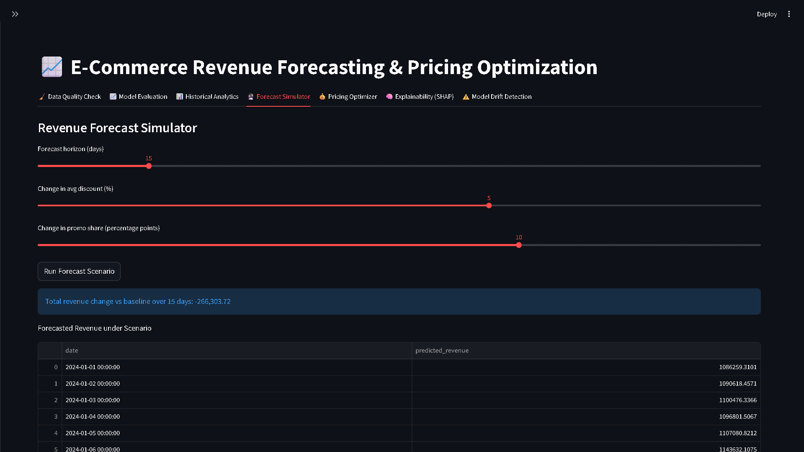
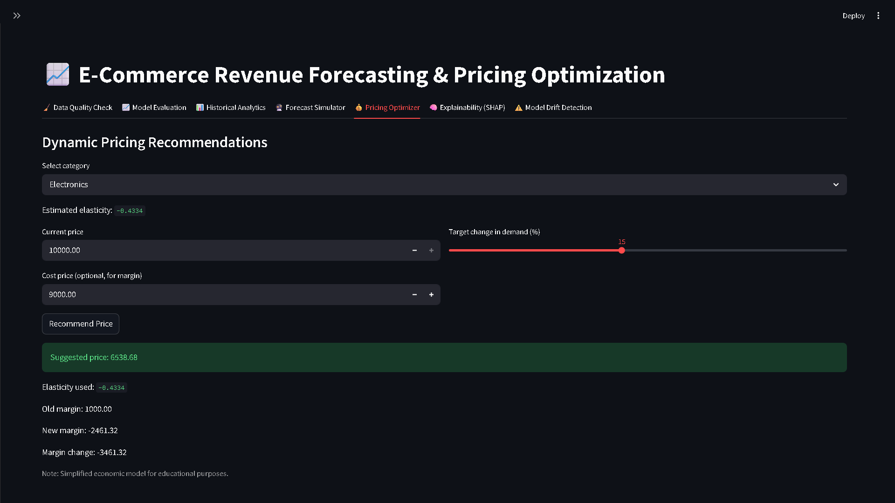
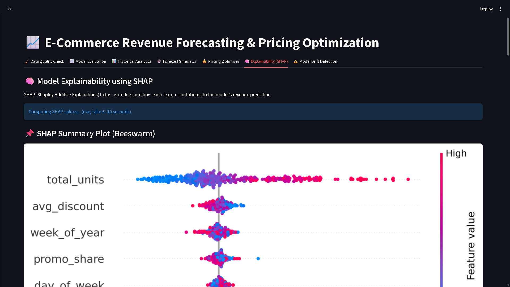
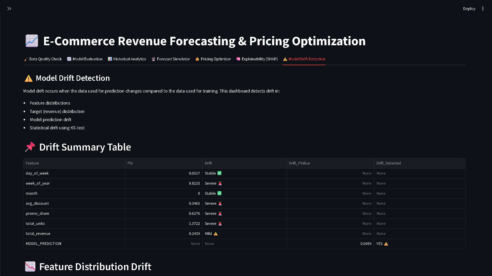
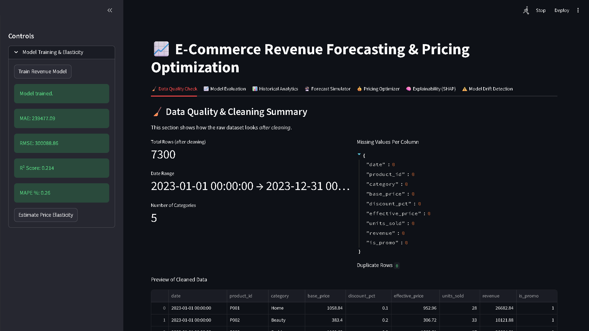
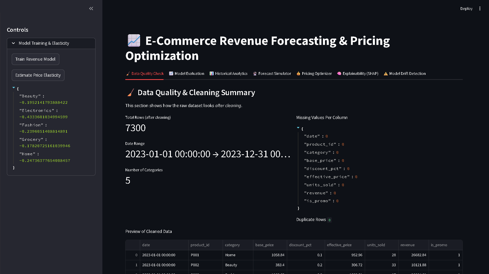

# 🌟 AI-Enabled E-Commerce Revenue Intelligence & Pricing Optimization System

### AI-Powered Business Analytics Platform • Revenue Forecasting • Pricing Intelligence • Decision Support

---

<div align="center">



<br/>
<i>Revenue Intelligence Platform for Pricing Optimization, Forecasting, Elasticity Analysis & Business Decision Support</i>

<br/>


</div>

---

# 🖼️ Project Overview

An AI-powered business analytics platform designed to forecast revenue trends, optimize pricing strategies, estimate price elasticity, and simulate business outcomes through interactive dashboards and decision intelligence workflows.

This project focuses on:
- Revenue forecasting
- Pricing optimization
- Elasticity analysis
- Business KPI monitoring
- Revenue simulation
- Scenario analysis
- Explainable analytics workflows
- Interactive business dashboards

Built using:
- Streamlit
- Scikit-learn
- SHAP
- Plotly
- Pandas & NumPy
- Random Forest Regressor

---

# 🚀 Key Business Capabilities

- Revenue forecasting & trend analysis
- Dynamic pricing optimization
- Price elasticity estimation
- Revenue impact simulation
- Scenario & stress testing
- Explainable AI insights using SHAP
- Drift detection & model monitoring
- Interactive business dashboards
- Executive-ready analytics workflows

---

# 💼 Business Problem

E-commerce businesses often struggle to:
- forecast future revenue accurately
- optimize pricing strategies dynamically
- estimate pricing sensitivity
- identify revenue-driving factors
- simulate business impact before pricing decisions

Poor pricing decisions can lead to:
- revenue loss
- reduced profitability
- inefficient promotions
- inaccurate demand planning
- reduced operational efficiency

This project demonstrates how AI-driven analytics can support:
- smarter pricing decisions
- revenue optimization
- pricing intelligence
- business forecasting workflows

---

# 📈 Business Impact

This system helps simulate:
- pricing strategy optimization
- revenue growth forecasting
- profitability analysis
- pricing sensitivity monitoring
- business KPI intelligence
- scenario-based decision support

The platform demonstrates how analytics workflows can improve:
- pricing effectiveness
- revenue planning
- strategic decision-making
- business forecasting accuracy

---

# 🧠 Platform Features

| Module                  | Function                        |
|-------------------------|---------------------------------|
| 📈 Revenue Forecasting  | Predict future revenue trends   |
| 💰 Pricing Optimization | Optimize pricing strategies     |
| 📊 Elasticity Analysis  | Estimate pricing sensitivity    |
| 🧠 SHAP Explainability  | Explain revenue-driving factors |
| ⚠️ Drift Detection      | Monitor model/data drift        |
| 🧪 Stress Testing       | Simulate business scenarios     |
| 📉 KPI Monitoring       | Track business performance      |
| 🌐 Streamlit Dashboard  | Interactive analytics workflows |

---

# 📸 Platform Screenshots


## ⭐ Dashboard Overview

<div align="center">
  
</div>


## ⭐ Data Quality Validation

<div align="center">
  
</div>


## ⭐ Model Evaluation Dashboard

<div align="center">
  
</div>


## ⭐ Historical Analytics

<div align="center">
  
</div>

---

<details>

<summary>View Additional Dashboard Screens</summary>

<br/>


## ⭐ Forecast Simulator

<div align="center">
  
</div>


## ⭐ Pricing Optimizer

<div align="center">
  
</div>


## ⭐ SHAP Explainability

<div align="center">
  
</div>


## ⭐ Model Drift Detection

<div align="center">
  
</div>


## ⭐ Train Revenue Model

<div align="center">
  
</div>


## ⭐ Estimate Price Elasticity

<div align="center">
  
</div>

</details>

---

# 📊 Key Business Insights

The analysis revealed several important pricing and revenue patterns:

### 🔹 Pricing sensitivity directly impacts revenue
Small pricing adjustments significantly affected revenue trends across multiple scenarios.

### 🔹 Certain product categories showed higher elasticity
Some product segments were considerably more price-sensitive than others.

### 🔹 Revenue forecasting improved business planning
Forecasting workflows helped simulate future revenue fluctuations and operational planning.

### 🔹 SHAP explainability improved interpretability
SHAP analysis highlighted the strongest drivers affecting revenue behavior.

### 🔹 Drift monitoring supported model reliability
Data drift detection helped identify changing business patterns over time.

These insights supported:
- pricing optimization workflows
- revenue intelligence strategies
- business decision support systems

---

# 🧬 Revenue Intelligence Workflow

```text
Business & Pricing Data
          ↓
Automated Data Cleaning Pipeline
          ↓
Feature Engineering & Analytics
          ↓
Revenue Forecasting Models
          ↓
Pricing Optimization Engine
          ↓
Elasticity Analysis & SHAP Insights
          ↓
Scenario Simulation & Drift Detection
          ↓
Interactive Streamlit Dashboard
          ↓
Business Decision Intelligence
````

---

# 🧩 End-to-End Workflow

1. Generate synthetic ecommerce transaction data
2. Clean and validate raw business data
3. Engineer pricing & revenue features
4. Train forecasting and optimization models
5. Estimate price elasticity patterns
6. Generate SHAP explainability insights
7. Detect model/data drift patterns
8. Simulate pricing and revenue scenarios
9. Explore interactive business dashboards

---

# 🧠 Tech Stack

| Category         | Technologies                |
| ---------------- | --------------------------- |
| Language         | Python 3.10+                |
| Data Analysis    | Pandas, NumPy               |
| Machine Learning | Scikit-learn, Random Forest |
| Explainability   | SHAP                        |
| Visualization    | Matplotlib                  |
| Dashboard/UI     | Streamlit                   |
| Testing          | PyTest                      |
| Utilities        | Joblib                      |

---

# 📁 Project Structure

```
Ecommerce-Revenue-Pricing-Optimizer/
│
├── app/
│   ├── cleaning.py               # Data cleaning pipeline
│   ├── data_loader.py            # Loads raw + processed data
│   ├── forecasting.py            # Model training, evaluation, plots
│   ├── pricing.py                # Elasticity + dynamic pricing
│   ├── insights.py               # Business insights & data quality
│   ├── drift_utils.py            # PSI-based drift detection
│   └── streamlit_app.py          # Full Streamlit dashboard
│
├── data/
│   ├── processed
│   │   └── modeling_data.csv
│   │   
│   ├── raw
│   │   └── transactions.csv
│   │   
│   └── synthetic_generator.py
│
├── models/
│   ├── revenue_model.pkl
│   └── elasticity.json
│
├── reports/
│   ├── csv
│   │   └── evaluation_report.txt
│   │   
│   └── visuals
│       ├── actual_vs_predicted.png
│       ├── residual_distribution.png
│       ├── feature_importance.png
│       └── error_over_time.png
│
│
├── screenshots/
│   ├── dashboard_overview.png
│   ├── data_quality.png
│   ├── estimate_price_elasticity.png
│   ├── forecast_simulator.png
│   ├── historical_analytics.png
│   ├── model_drift.png
│   ├── model_evaluation.png
│   ├── pricing_optimizer.png
│   ├── shap_explainability.png
│   └── train_model.png
│
├── tests/
│   ├── test_data_loader.py
│   ├── test_forecasting.py
│   ├── test_pricing.py
│   ├── test_app_model_file.py
│   ├── test_shap_explainability.py
│   ├── test_drift_detection.py
│   ├── test_visualizations.py
│   ├── test_forecast_stress.py
│   ├── test_pricing_stress.py
│   └── test_data_integrity.py
│
├── README.md
└── requirements.txt
```

---

# ⚙️ Installation

## 1️⃣ Clone Repository

```bash
git clone https://github.com/girishshenoy16/Ecommerce-Revenue-Pricing-Optimizer.git
cd Ecommerce-Revenue-Pricing-Optimizer
```

## 2️⃣ Create Virtual Environment

```bash
python -m venv venv
venv\Scripts\activate
```

## 3️⃣ Install Dependencies

```bash
python.exe -m pip install --upgrade pip
pip install -r requirements.txt
```

---

# ▶️ Running the Project

## 1️⃣ Generate Synthetic Data

```bash
python data/synthetic_generator.py
```

## 2️⃣ Launch Streamlit Dashboard

```bash
streamlit run app/streamlit_app.py
```

---

# 🧰 Important First-Run Actions (Inside Streamlit)

After launching the dashboard:

## ✔ Train Revenue Model

Use the sidebar option:

**➡️ Train Revenue Model**

<div align="center">
  
</div>

This generates:

* `revenue_model.pkl`
* evaluation reports
* model performance visualizations

---

## ✔ Estimate Price Elasticity

Use the sidebar option:

**➡️ Estimate Price Elasticity**

<div align="center">
  
</div>


This generates:

* `elasticity.json`
* pricing intelligence insights
* elasticity-driven optimization workflows

After completing these steps, all dashboard modules become fully functional.

---

# 🧪 Testing the Project

Run all tests:

```bash
pytest 
pytest -q
```

Run verbose tests:

```bash
pytest -v
```

The testing suite includes:

* forecasting tests
* pricing optimization tests
* SHAP explainability tests
* drift detection tests
* visualization tests
* stress tests
* data integrity validation

---

# 🔮 Future Scope

* Prophet/SARIMA forecasting enhancements
* Multi-product elasticity estimation
* Real-time pricing intelligence systems
* Automated retraining pipelines & workflows
* Inventory-aware price optimization engines
* Advanced business KPI monitoring
* Cloud deployment & API integration

---

# 🤝 Contribution

Contributions, suggestions, and improvements are welcome.

If you found this project valuable, consider starring the repository.

---

<div align="center">

### ⚡ Revenue Intelligence & Pricing Analytics for Smarter Business Decisions

</div>